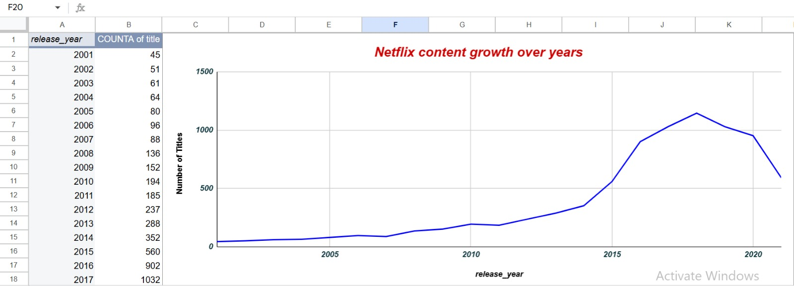
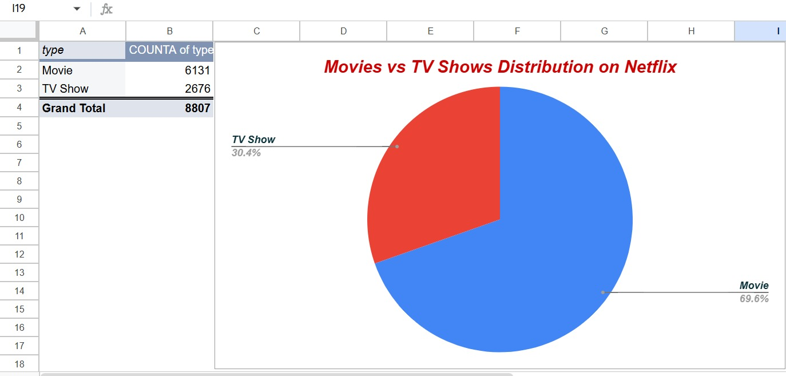
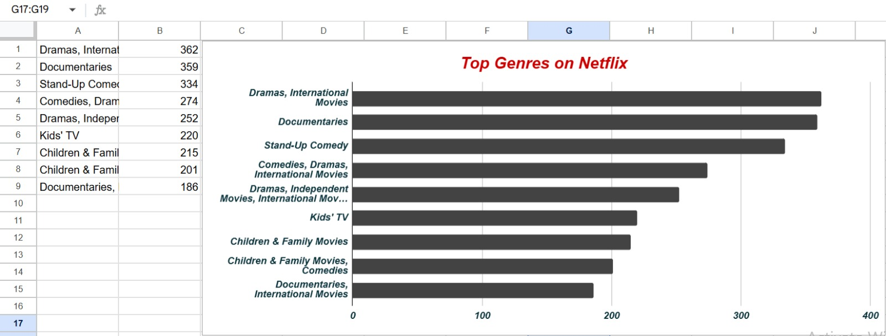

# Netflix Data Analysis 📊

This project analyzes Netflix dataset using Google Sheets to extract meaningful insights using Pivot Tables and Data Visualization.

---

## 🔍 Key Insights
- Significant growth in Netflix content after 2015 📈
- Movies dominate the platform (~70%) compared to TV Shows 🎬
- Top genres include Drama, Documentaries, and Stand-up Comedy 🎭

---

## 🛠 Tools Used
- Google Sheets
- Pivot Tables
- Data Visualization (Bar Chart, Line Chart, Pie Chart)

---

## 📁 Dataset
- netflix_titles_CLEANED.csv

---

## 📊 Visualizations

### 📈 Content Growth Over Years

### 🎬 Movies vs TV Shows Distribution

### 🎭 Top Genres on Netflix

---

## 🚀 What I Learned
- Data cleaning and preprocessing
- Using pivot tables for analysis
- Building visual dashboards
- Presenting insights effectively

---

⭐ This is my first data analytics project. More projects coming soon!
